# Misskey用カスタムCSS

## 更新履歴
<details><summary>クリックで展開できます</summary><div>

- 2023/11/10
  - 【Update】通知インジケータから件数を消す
- 2023/11/08
  - 【New】通知インジケータから件数を消す
  - 【New】通知インジケータそのものを消す
- 2023/11/01
  - 【New】リアクションのホバー時にポップアップを非表示
  - 【New】リアクションのホバー時にリアクションしたユーザー一覧を非表示
  - 【New】リアクションの数を非表示
  - 【New】デッキUIでLTLの画像をぼかす
  - 【New】デフォルトUIでLTLの画像をぼかす
- 2023/09/10
  - 【Update】Renoteの非表示（デッキスタイル）
- 2023/08/07
  - 【New】CW設定されたノートのリアクションをぼかす（ホバーで表示）
- 2023/08/05
  - 【Update】指定したリアクションをノートや通知欄から消す（Unicode絵文字版）
- 2023/07/29
  - 【New】NSFWを含むノートを非表示
- 2023/07/26
  - 【Update】NSFW画像のサムネをクリック後もぼかす
- 2023/07/22
  - 【Update】HTL以外で画像サイズを変更
- 2023/07/19
  - 【Update】デッキUI指定カラムのリアクションをぼかす（ホバーで表示）
  - 【Update】デッキUI指定カラムのリアクション全非表示
- 2023/07/09
  - 【New】NSFW画像のサムネをクリック後もぼかす
- 2023/07/06
  - 【Update】ドライブの画像を大きくする
  - 【Update】投稿時に添付画像サムネイルを大きくする
- 2023/06/17
  - 【New】ユーザーアイコンの差し替え
- 2023/06/07
  - 【Update】リアクション選択のサイズ調整
  - 【Update】通知とフォロー一覧のフォロー解除を押せなくする
- 2023/05/11
  - 【Update】デッキUI 編集サイドバーを非表示
  - 【Update】デフォルトUIウィジェットの編集リンク非表示
- 2023/05/10
  - 【Update】デッキUI 編集サイドバーを非表示
- 2023/05/06
  - 【New】通知のリンク幅を文字列の部分だけにする
- 2023/04/14
  - 目次の追加
  - 【New】デッキUI指定カラムのリアクションをぼかす（ホバーで表示）
  - 【New】投稿フォームの要素順序並び替え
  - 【New】UIアニメーションを減らしていてもねこ耳を動かせるようにする
- 2023/04/13
  - 【Update】外部のリアクションをわかりやすくする
- 2023/04/12
  - 【Update】ドライブの画像を大きくする
- 2023/04/11
  - 【New】特定のノートに対する通知を通知欄から非表示にする
- 2023/04/10
  - 【Update】自分のノートはリアクションできないようにする
- 2023/04/09  
  - 【Update】ドライブの画像を大きくする  
  - 【Update】投稿時に添付画像サムネイルを大きくする  
  - 【Update】Misskey.ioの宇宙猫アイコンを差し替える  
- 2023/04/06  
  - 【New】「サーバーから切断されました」を非表示  
  - 【New】ドライブの画像を大きくする  
  - 【New】投稿時に添付画像サムネイルを大きくする  
  - 【New】Misskey.ioの宇宙猫アイコンを差し替える  
  ※ faviconとapple-touch-iconは変わりません  
  代わりにUserScriptをお使いください  
  https://greasyfork.org/ja/scripts/463386  
  
- 2023/04/01  
  GitHubにお引っ越し中  
  - TLでパトロンバッジを非表示にする  
  - ホバー時の絵文字を拡大  
  
- 2023/03/17  
  - 【Update】フォロー解除を押せなくするCSSを、プロフィールを開けば押せるように変更  

- 2023/03/13  
  - 【Update】絶対時間表記「のみ」にするよう変更  

- 2023/03/12  
  - チカチカ絵文字対策にGitHub Pagesでホスティングしてあるものを追加

- 2023/03/08  
  - 【Update】デッキUIで特定カラムのRenote非表示（セレクタを修正しました）  

- 2023/03/06  
  - 【Update】自分のノートはリアクションできないようにする  
  - 特定の人がしたRenoteを非表示にする  

- 2023/03/04  
  - スマホで通知受信時のポップアップ非表示  
  - TLの画像サイズを変更（高さ）  

- 2023/03/03  
  - 特定リアクションをノートや通知一覧から非表示  
  - フォロー解除ボタンを誤って押せないようにする  
  - チャンネル投稿を非表示（HTLまたはリストTLを含むすべて）  
  - HTL以外で画像サイズを変更（幅）  
  - セレクタの記述を全体的に修正  

- 2023/02/27  
  - 指定したリアクションをノートや通知欄から消す例  
  - スマホ向けカスタムCSSのリアクション選択時の絵文字サイズ調整  

- 2023/02/25  
  - 指定した絵文字ピッカーのカテゴリ非表示  
  - FirefoxでカスタムCSSを使用する際の説明を概要欄に追記  

- 2023/02/20  
  - ページ編集時の複製ボタンを無効化  
  - 特定の絵文字を含んでいるノートを非表示にする  

- 2023/02/12  
  - リアクション選択のサイズ調整  

- 2023/02/08  
  - チカチカ絵文字をおとなしくする  

- 2023/02/07  
  - MFMの極端に大きなテキストを抑制  

- 2023/02/06  
  - 外部のリアクションをわかりやすくする  

- 2023/02/05  
  - スマホ用デザイン調整（Android, iOS）  
  - デフォルトUIウィジェットの編集リンク非表示  

- 2023/02/04  
  - v13.3.4で確認  
  - デッキUIで特定カラムのリアクションをすべて非表示にするCSSを追加  
  - 指定数よりリアクションが多いとき分かりやすいように文字でマークを付けるようにした  
  - 特定条件のときノート入力ポップアップ内の要素が表示しきれてなかったのでスクロールするように修正  

- 2023/02/04 初版  
  - v13.2.6で確認  
</div></details>

## 目次
<details><summary>クリックで展開できます</summary><div>

- [Misskey用カスタムCSS](#misskey用カスタムcss)
  - [更新履歴](#更新履歴)
  - [目次](#目次)
  - [説明](#説明)
  - [カスタムCSSの設定例](#カスタムcssの設定例)
    - [投稿日時に絶対時間表記にする](#投稿日時に絶対時間表記にする)
    - [Renoteの非表示](#renoteの非表示)
      - [すべてのスタイル（デフォルト、デッキ、クラシック）に適用する場合](#すべてのスタイルデフォルトデッキクラシックに適用する場合)
      - [デッキスタイルで特定のカラムのみ対象の場合](#デッキスタイルで特定のカラムのみ対象の場合)
    - [デッキUI指定カラムのリアクションをぼかす（ホバーで表示）](#デッキui指定カラムのリアクションをぼかすホバーで表示)
    - [CW設定されたノートのリアクションをぼかす（ホバーで表示）](#cw設定されたノートのリアクションをぼかすホバーで表示)
    - [デッキUI指定カラムのリアクション全非表示](#デッキui指定カラムのリアクション全非表示)
    - [デッキUI 編集サイドバーを非表示](#デッキui-編集サイドバーを非表示)
    - [デッキUIのポップアップ調整](#デッキuiのポップアップ調整)
    - [ノート入力ポップアップ全般](#ノート入力ポップアップ全般)
      - [ノート入力ポップアップ](#ノート入力ポップアップ)
      - [ノート入力欄](#ノート入力欄)
      - [ノートのプレビュー](#ノートのプレビュー)
      - [ノート入力での絵文字ピッカー](#ノート入力での絵文字ピッカー)
      - [投稿フォームの要素順序並び替え](#投稿フォームの要素順序並び替え)
      - [返信元ノートをスクロール可能にする](#返信元ノートをスクロール可能にする)
    - [自分のノートはリアクションできないようにする](#自分のノートはリアクションできないようにする)
    - [ノートに添付されたGIFアニメをホバー時のみ表示（普段は隠す）](#ノートに添付されたgifアニメをホバー時のみ表示普段は隠す)
    - [長いノートを指定行以降省略する](#長いノートを指定行以降省略する)
    - [大量にリアクションが付いている場合に非表示](#大量にリアクションが付いている場合に非表示)
    - [デフォルトUIウィジェットの編集リンク非表示](#デフォルトuiウィジェットの編集リンク非表示)
    - [外部のリアクションをわかりやすくする](#外部のリアクションをわかりやすくする)
    - [MFMの極端に大きなテキストを抑制](#mfmの極端に大きなテキストを抑制)
    - [チカチカ絵文字の視覚的刺激を軽減する](#チカチカ絵文字の視覚的刺激を軽減する)
      - [importバージョン](#importバージョン)
      - [自分で個別に指定する場合](#自分で個別に指定する場合)
    - [リアクション選択のサイズ調整](#リアクション選択のサイズ調整)
    - [ページ編集時の複製ボタンを無効化](#ページ編集時の複製ボタンを無効化)
    - [特定の絵文字を含んでいるノートを非表示にする](#特定の絵文字を含んでいるノートを非表示にする)
    - [指定した絵文字ピッカーのカテゴリ非表示](#指定した絵文字ピッカーのカテゴリ非表示)
    - [スマホ用デザイン調整（Android, iOS）](#スマホ用デザイン調整android-ios)
    - [指定したリアクションをノートや通知欄から消す](#指定したリアクションをノートや通知欄から消す)
    - [チャンネル投稿を非表示](#チャンネル投稿を非表示)
    - [HTL以外で画像サイズを変更](#htl以外で画像サイズを変更)
    - [スマホで通知受信時のポップアップ非表示](#スマホで通知受信時のポップアップ非表示)
    - [特定の人がしたRenoteを非表示](#特定の人がしたrenoteを非表示)
    - [通知とフォロー一覧のフォロー解除を押せなくする](#通知とフォロー一覧のフォロー解除を押せなくする)
    - [TLでパトロンバッジを非表示にする](#tlでパトロンバッジを非表示にする)
    - [ホバー時の絵文字を拡大](#ホバー時の絵文字を拡大)
    - [ウィジェット編集](#ウィジェット編集)
    - [Misskey.ioのアイコン差し替え（宇宙猫対策）](#misskeyioのアイコン差し替え宇宙猫対策)
    - [「サーバーから切断されました」を非表示](#サーバーから切断されましたを非表示)
    - [ドライブの画像を大きくする](#ドライブの画像を大きくする)
    - [投稿時に添付画像サムネイルを大きくする](#投稿時に添付画像サムネイルを大きくする)
    - [サーバー切断時のボタンをいい感じにする](#サーバー切断時のボタンをいい感じにする)
    - [特定のノートに対する通知を通知欄から非表示にする](#特定のノートに対する通知を通知欄から非表示にする)
    - [UIアニメーションを減らしていてもねこ耳を動かせるようにする](#uiアニメーションを減らしていてもねこ耳を動かせるようにする)
    - [通知のリンク幅を文字列の部分だけにする](#通知のリンク幅を文字列の部分だけにする)
    - [ユーザーアイコンの差し替え](#ユーザーアイコンの差し替え)
    - [NSFW画像のサムネをクリック後もぼかす](#nsfw画像のサムネをクリック後もぼかす)
    - [NSFWを含むノートを非表示](#nsfwを含むノートを非表示)
    - [リアクションのホバー時にポップアップを非表示](#リアクションのホバー時にポップアップを非表示)
    - [リアクションのホバー時にリアクションしたユーザー一覧を非表示](#リアクションのホバー時にリアクションしたユーザー一覧を非表示)
    - [リアクションの数を非表示](#リアクションの数を非表示)
    - [デッキUIでLTLの画像をぼかす](#デッキuiでltlの画像をぼかす)
    - [デフォルトUIでLTLの画像をぼかす](#デフォルトuiでltlの画像をぼかす)
    - [通知インジケータから件数を消す](#通知インジケータから件数を消す)
    - [通知インジケータそのものを消す](#通知インジケータそのものを消す)
    - [テンプレ](#テンプレ)
- [欲しいものリスト](#欲しいものリスト)

</div></details>

## 説明
個人的に使用しているカスタムCSSをまとめました。  
かゆいところに手が届く…かもしれません。  
設定 → 全般 → カスタムCSSより設定することができます。  

基本的にはMisskeyの最新リリース版にて作成しています。  
動作しない場合はまずお使いのインスタンスバージョンが最新かどうか確認してください。  
Windows上のChrome(Vivaldi)およびFirefoxのデフォルト/デッキUI, Android 13のデフォルトUI, iPhone SE(iOS 16)のデフォルトUIにて最低限の確認をしています。  
ただし私自身がMisskeyで利用している機能が限られているため、確認していないページで不都合が生じる可能性があります。  
あくまで自己責任にてご使用くださいませ。

アップデートなどにより予告なく動作しなくなる、または表示が崩れることがあるかもしれません。  
その場合はカスタムCSSをなにも設定していない状態に戻してみてください。  
不具合報告は [`@kanade`](https://mfmf.club/@kanade) までお願いいたします。

さらに快適なMisskeyライフのお供になれれば幸いです。  

Stylusを使うとMisskeyの設定でいちいち変えなくても切り替えられるのでオススメです。  
- Chrome, Edgeなど  
https://chrome.google.com/webstore/detail/stylus/clngdbkpkpeebahjckkjfobafhncgmne?hl=ja  
- Firefox  
https://addons.mozilla.org/ja/firefox/addon/styl-us/  

---

## カスタムCSSの設定例

### 投稿日時に絶対時間表記にする
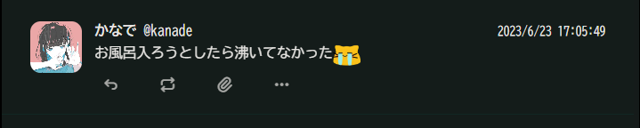
```css
time {
    font-size: 0;
}
time:after {
    content: attr(title);
    font-size: 0.9rem;
}
```

---

### Renoteの非表示
#### すべてのスタイル（デフォルト、デッキ、クラシック）に適用する場合
```css
.xcSej.x3762:has(.xBwhh) {
    display: none;
}
```
#### デッキスタイルで特定のカラムのみ対象の場合
```css
/* この場合は左から数えて2番目と3番目のカラムにのみ適用 */
.xrNPB section:nth-child(2) .xcSej.x3762:has(.xBwhh),
.xrNPB section:nth-child(3) .xcSej.x3762:has(.xBwhh)
{
    display: none;
}
```

---

### デッキUI指定カラムのリアクションをぼかす（ホバーで表示）
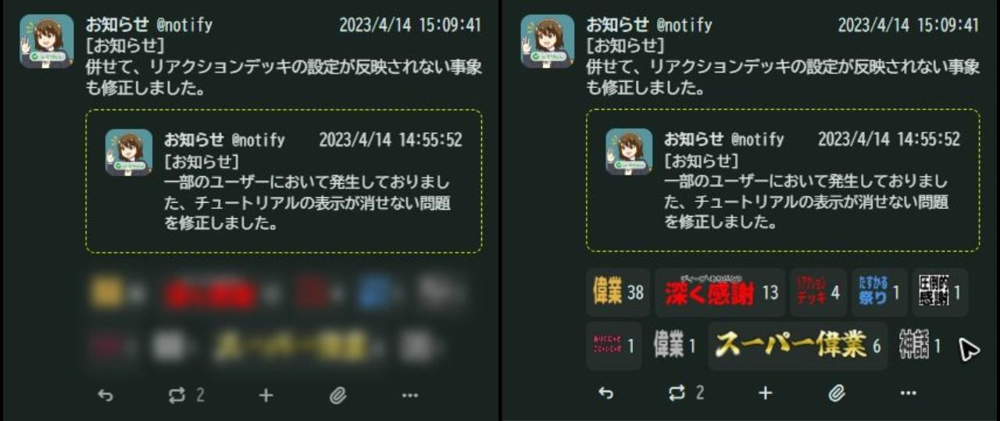
指定したカラムのノートに付いているリアクションをぼかして表示します。  
マウスホバーかタップ＆ホールドで通常表示できます。
```css
/* この場合は左から数えて3番目のカラムにのみ適用 */
section.xAOWy:nth-child(3) .xlT1y {
	filter: blur(5px);
}
section.xAOWy:nth-child(3) .xlT1y:hover {
	filter: none;
}
```

---

### CW設定されたノートのリアクションをぼかす（ホバーで表示）
CW設定されたノートのリアクションをぼかします。（画像は前項参照）  
苦手な内容を類推させるリアクションを隠したいときにどうぞ。  
マウスホバーかタップ＆ホールドで通常表示できます。

```css
div.xDn7E:has(._button.xd2wm) .xlT1y {
    filter: blur(5px);
}

div.xDn7E:has(._button.xd2wm) .xlT1y:hover {
	filter: none;
}
```

---

### デッキUI指定カラムのリアクション全非表示
リアクションしてなんぼのMisskeyですが、ときには見るのがつらいときもあるので、そういうとき心の平穏を保てるかもしれません。  
（自分のノートに全然リアクション付かないのに、あとから投稿されたノートにばかりリアクションが付いたりすると凹むときあるよね…）
```css
/* この場合は左から数えて3番目のカラムにのみ適用 */
section.xAOWy:nth-child(3) .xlT1y
{
	display: none;
}
```

---

### デッキUI 編集サイドバーを非表示
```css
.xECNb {
	display: none;
}
```

---

### デッキUIのポップアップ調整
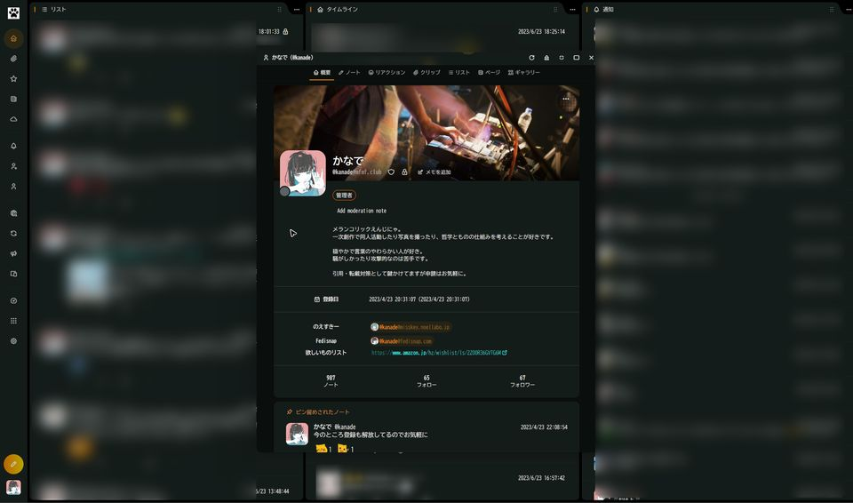
```css
.xpAOc:not(.xwAht) {
	width: 720px !important;
	height: 960px !important;
	top: calc(50% - 960px / 2);
    left: calc(50% - 720px / 2);
}
```

---

### ノート入力ポップアップ全般
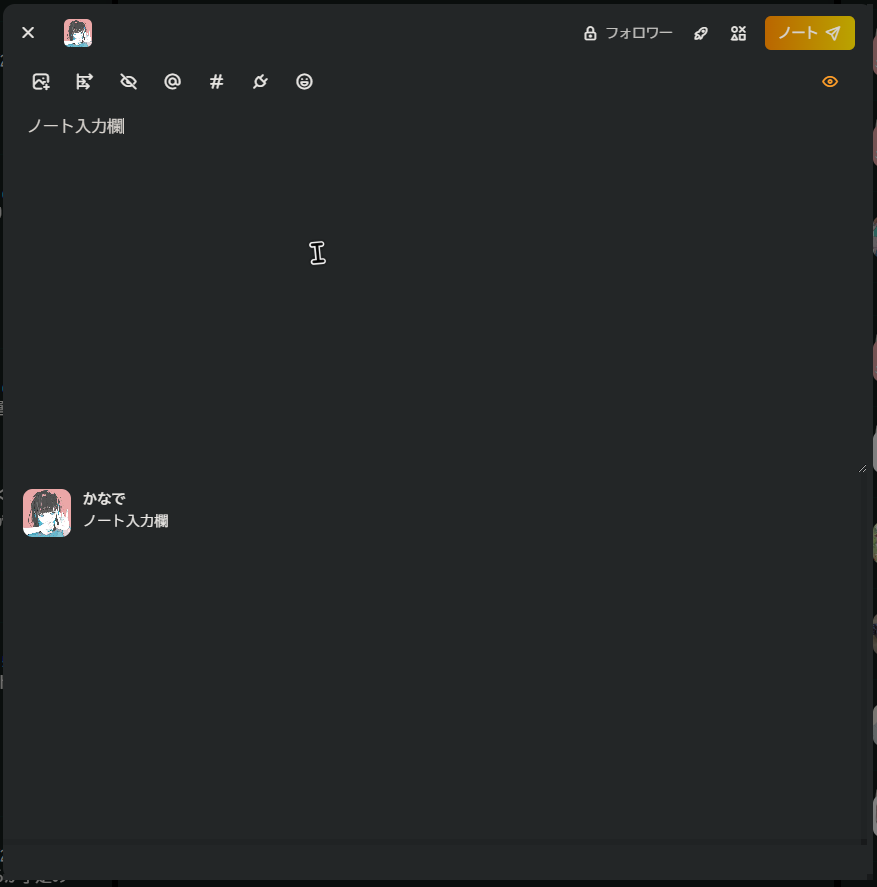
#### ノート入力ポップアップ
```css
.xpDI4.xxtDg._popup {
	width: 720px;
	height: 960px;
	top: calc(50% - 960px / 2);
	max-width: initial;
	overflow: scroll;
}
```
#### ノート入力欄
```css
.xpDI4.xxtDg._popup .x8B0D {
	height: 400px;
}
```
#### ノートのプレビュー
```css
.xpDI4.xxtDg._popup .xoGjR {
	height: 400px;
    overflow: scroll;
}
```
#### ノート入力での絵文字ピッカー
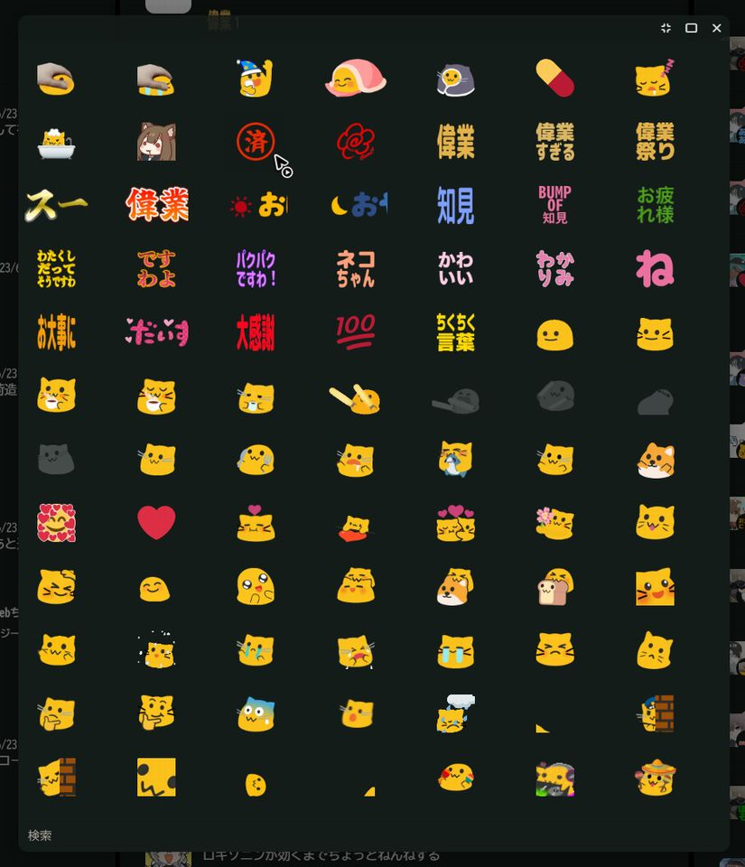
```css
.xpAOc .omfetrab,
.xpAOc .emojis
{
	width: 720px;
	height: 880px;
}
```

#### 投稿フォームの要素順序並び替え
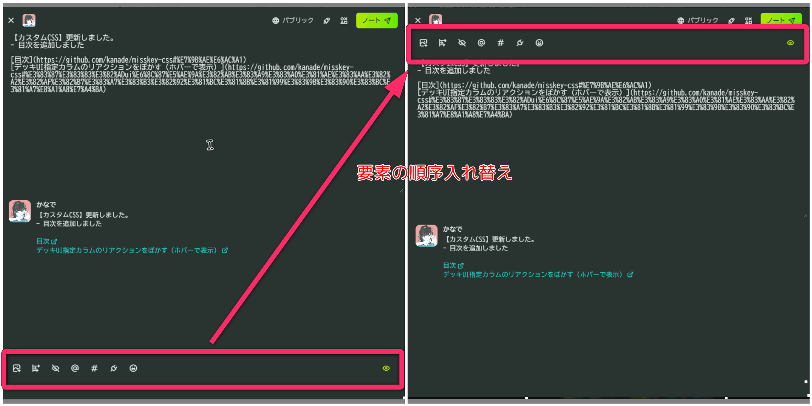
```css
/* 投稿フォームの要素順序並び替え */
.xpDI4.xxtDg._popup {
    display: flex;
    flex-flow: column;
}
/* header */
.x6ccQ {
    order: 1;
}
/* 返信元 */
.xynJn.xhv1G {
    order: 2;
}
/* CW注意文の入力欄 */
.xxQx9 {
    order: 4;
}
/* ノート本文の入力欄 */
.xnEld {
    order: 5;
}
/* ハッシュタグ */
.xqwIh {
    order: 6;
}
/* プレビュー */
.xEd72.xoGjR {
    order: 7;
}
/* ツールバー（画像添付やアンケート、絵文字ピッカーなど） */
.xkr7J {
    order: 3;
}
```

#### 返信元ノートをスクロール可能にする
```css
.xynJn.xhv1G {
    overflow: scroll;
}
```

---

### 自分のノートはリアクションできないようにする
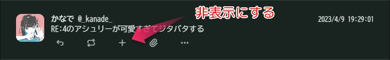  
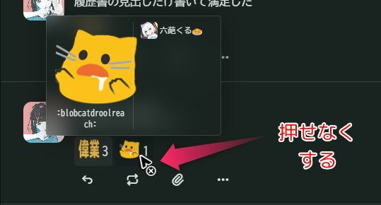

（ノート詳細を開くと自分のノートでもリアクション追加できるのは仕様です）
```css
/*
 * コード内の`@_kanade_`のところを自分のユーザー名にしてください
 * 3箇所あります
 */
/* ＋ボタンの非表示 */
.x5yeR > a[href="/@_kanade_"] + .xDn7E .xhAPG > button:has(.ti-plus) {
    display: none;
}
/* すでに付いているリアクションを押せないようにする */
.x5yeR > a[href="/@_kanade_"] + .xDn7E .xlT1y > button:hover {
    pointer-events: all;
    cursor: not-allowed;
}
.x5yeR > a[href="/@_kanade_"] + .xDn7E .xlT1y > button:active {
    pointer-events: none;
}
```

---

### ノートに添付されたGIFアニメをホバー時のみ表示（普段は隠す）
```css
.gqnyydlz.image:has(.gif) img {
	visibility: hidden;
}

.gqnyydlz.image:has(.gif):hover img {
	visibility: visible;
}
```

---

### 長いノートを指定行以降省略する
```css
.xDn7E .x7pHL {
	display: -webkit-box;
	-webkit-box-orient: vertical;
	-webkit-line-clamp: 10; /* この場合は10行まで表示 */
	overflow: hidden;
}

/* ノート全文をホバー（タップ）で表示 */
.xDn7E:hover .x7pHL {
	display: block;
	overflow: visible;
}
```
[プラグインを作成しました](https://misskey.io/@_kanade_/pages/1677390200412)

---

### 大量にリアクションが付いている場合に非表示
```css
/* この場合は11個以上リアクションが付いているとき、11個目以降を非表示にします */
/* n + 11 の 11 の数字を変更する */

/* 隠すだけだと分かりづらいので指定数以上リアクションがある場合は詳細ボタンをアクセントカラーにする（お好みで） */
.xDn7E:has(button:nth-child(11)) .ti-dots:before {
	color: var(--accent);
}

/* 隠すだけだと分かりづらいので指定数以上リアクションがある場合はマークを付ける（お好みで） */
.xDn7E:has(button:nth-child(11)) button:last-child:after {
	margin-left: 28px;
	content: "★";
}

/* 指定数以降のリアクションを省略 */
.xDn7E button:nth-child(n + 11) {
	display: none;
}

/* リアクションをホバー（タップ）で表示 */
.xDn7E:hover button:nth-child(n + 11) {
	display: inline-block;
}
```
疑似クラスの使い方はこちらをご参照ください。  
https://developer.mozilla.org/ja/docs/Web/CSS/:nth-child

---

### デフォルトUIウィジェットの編集リンク非表示
```css
._textButton.xxDDL {
	display: none !important;
}
```

---

### 外部のリアクションをわかりやすくする
```css
.xDRXD:not(.xhTzr) img {
	filter: grayscale(100%); /* グレースケール */
	pointer-events: none; /* カーソルイベントを無効 */
}
```

---

### MFMの極端に大きなテキストを抑制
```css
.mfm-x2, .mfm-x3, .mfm-x4 {
	font-size: 150%;
    --mfm-zoom-size: 150%;
}

.x7pHL span {
    transform: initial !important;
}
```

---

### チカチカ絵文字の視覚的刺激を軽減する
#### importバージョン
GitHub Pagesでホスティングしてみました。  
以下の記述だけで適用されます。  

ソースはこちら。  
https://github.com/kanade/misskey-css/blob/main/anti-blinking-emojis.css

全部の絵文字見てリストアップするのが一番大変だった…わりと厳しめに指定してあります。  
独断と偏見でサクッと選んだので、要望ありましたらMisskey内やGitHubのプルリクなどでどうぞ。  

```css
/* チカチカ絵文字を白黒にする */
@import url("https://kanade.github.io/misskey-css/anti-blinking-emojis.css");
```
#### 自分で個別に指定する場合
```css
/* [alt=":xxxxxxxx:"] に絵文字の名前を指定する */
.xeJ4G[alt=":emergency:"],
.xeJ4G[alt=":fastparrot:"],
.xeJ4G[alt=":ultrafastparrot:"],
.xeJ4G[alt=":ablobcathyper:"],
.xeJ4G[alt=":eyes_fidgeting:"],
.xeJ4G[alt=":twinsparrot:"]
{
	filter: grayscale(100%);
	opacity: .25;
}
```

---

### リアクション選択のサイズ調整
```css
/* 基本設定 → リアクション一覧の枠 */
.xaBSl {
    padding: 6px;
}

/* 絵文字のサイズ */
.xaBSl > button > img.xeJ4G.x5kTm,
.xaBSl > button > img.xagin
{
    height: 2.25em;
}

/* 追加ボタンのポップアップサイズ */
.omfetrab.h2[data-v-c741f690] {
    width: 492px;
    height: 640px;
}

/* ==== リアクションシューティング用 ==== */
/* 絵文字選択 */
.omfetrab {
    width: 48em !important;
    height: 640px !important;
}
/* 絵文字のサイズ */
.omfetrab > .emojis section > .body > .item > .emoji {
    height: 2em !important;
}
.omfetrab > .emojis section > .body > .item {
    height: 80px !important;
    width: 80px !important;
}
```

---

### ページ編集時の複製ボタンを無効化
```css
._button.xbaFh.xfjt2:has(i.ti-copy) {
    pointer-events: none;
}
```

---

### 特定の絵文字を含んでいるノートを非表示にする
私の確認不足でしたがワードミュートで普通に対応できますね…  
ワードミュートに設定したあとにTLに流れたノートのみ対象となるようです。  

このカスタムCSSではハードミュート同様にTLから完全に消し去りますが、StylusなどでON/OFFしやすいというメリットがあるかもしれません。
```css
/* 絵文字の名前を指定する */
.xcSej.x3762:has(.x7pHL .xeJ4G[title=":yosano_akiko_is_always_watching_you:"]) {
    display: none;
}
```

---

### 指定した絵文字ピッカーのカテゴリ非表示
CSSだと使いづらかったのでUserScriptを書きました  

https://github.com/kanade/misskey-UserScript/blob/main/userscript-remove-emoji-categories.js

```css
/* この場合は左から数えて2番目と3番目のカラムにのみ適用 */
.emojis > .group[data-v-c741f690]:not(.index) > :nth-child(-n+8),
.emojis > .group[data-v-c741f690]:not(.index) > :nth-child(n+16):nth-child(-n+28),
.emojis > .group[data-v-c741f690]:not(.index) > :nth-child(n+30):nth-child(-n+39),
.emojis > .group[data-v-c741f690]:not(.index) > :nth-child(n+40)
{
	display: none;
}
```

---

### スマホ用デザイン調整（Android, iOS）
AndroidやiPhoneなどディスプレイサイズの小さいデバイス向けに表示を調整します。  
このページに載せているカスタムCSS例をスマホ用に調整したセットです。  

※ ブラウザによってはCSSのプロパティに!importantを付けないと反映されないことがあります。  

例：  
- 効かないかも
  `display: none;`
- 効く
  `display: none !important;`

```css
/* RN非表示 */
.xcSej.x3762:has(div.xBwhh) {
	display: none;
}

/* ウィジェットの編集リンク非表示 */
.mk-widget-edit {
	display: none !important;
}

/* デッキUI 編集サイドバー */
.left > .xECNb {
	display: none;
}

/* 絶対時間表記 */
time:after {
	content: " " attr(title);
}

/* ボタン */
.xApN7 {
	background: none;
	border-top: none;
	grid-template-columns: 1fr 1fr 1fr 1fr;
}

.xyfXN._button:not(.x7c6u) {
	background: rgba(0, 0, 0, 0.3);
}

.xyfXN._button:has(i.ti-apps) {
	display: none;
}

/* MFM */
.mfm-x2, .mfm-x3, .mfm-x4 {
	font-size: 150%;
    --mfm-zoom-size: 150%;
}
.x7pHL span {
    transform: initial !important;
}

/* 外部インスタンスのリアクション */
.xDRXD > .xeJ4G.x5kTm.x9Io4:not([src^="https://s3.arkjp.net/"]) {
	filter: grayscale(100%);
	pointer-events: none;
}

/* 絵文字のカテゴリ非表示 */
.emojis > .group[data-v-c741f690]:not(.index) > section:nth-child(-n+8),
.emojis > .group[data-v-c741f690]:not(.index) > section:nth-child(n+16):nth-child(-n+28),
.emojis > .group[data-v-c741f690]:not(.index) > section:nth-child(n+30):nth-child(-n+39),
.emojis > .group[data-v-c741f690]:not(.index) > section:nth-child(n+41)
{
	display: none;
}
```

---

### 指定したリアクションをノートや通知欄から消す
ノートに付いた指定のリアクションおよび、指定のリアクションされたという通知を消し去ります。  
どうしても見たくない絵文字がある！という場合に「特定の絵文字を含んでいるノートを非表示にする」カスタムCSSや、Misskey公式のワードミュートと組み合わせてお使いください。  
```css
/* ノートに付いたリアクション一覧から消し去ります */
._button.xDRXD.xhTzr:has([title=":chikuwa:"]) {
    display: none;
}

/* 見たくない絵文字の通知を通知欄から消し去ります */
.notification:has(.xAV2R [title=":chikuwa:"]) {
    display: none;
}
```

Unicode絵文字を非表示にしたい場合はこちら
```css
/* Unicode絵文字版 */
/* ノートに付いたリアクション一覧から消し去ります */
._button.xDRXD.xhTzr:has([alt="🐶"]) {
    display: none;
}
/* 見たくない絵文字の通知を通知欄から消し去ります */
.notification:has(.xAV2R [alt="🐶"]) {
    display: none;
}
```

---

### チャンネル投稿を非表示
既知の不具合：  
チャンネル投稿に対する返信が対象の場合、返信元だけ表示されてしまう。早めに直します…
```css
/* リストは除外したい場合 */
div:has(.xj7PE:first-child) + div .x5yeR:has(.xww2J[href^="/channels/"]) {
    display: none;
}

/* リストも対象にしていい場合 */
.x5yeR:has(.xww2J[href^="/channels/"]) {
    display: none;
}
```

---

### HTL以外で画像サイズを変更
```css
/* 画像の幅を調整 */
/* デッキスタイルで特定のTLのみ */
/* この場合はデッキ左から数えて3番目のカラムにのみ適用 */
.xrNPB section:nth-child(3) .xcKaF .xkJBF
{
    width: 50%;
    /* これを入れると中央揃え */
    margin-left: auto;
    margin-right: auto;
}

/* 画像の高さを調整 */
.xutAY.xsfFg {
	height: 100px !important;
    margin-left: auto !important;
    margin-right: auto !important;
}
```

---

### スマホで通知受信時のポップアップ非表示
```css
/* 通知ポップアップを非表示 */
.xpjbG {
    display: none !important;
}
```

---

### 特定の人がしたRenoteを非表示
```css
/* `@_kanade_`のところをRenoteを表示したくないユーザー名にする */
.xcSej:has(.xBwhh [href^="/@_kanade_"]) {
	display: none;
}
```

---

### 通知とフォロー一覧のフォロー解除を押せなくする
```css
/* 通知とフォロー/フォロワー一覧のフォロー/フォロー解除を押せなくする */
/* 誤フォロー、誤フォロー解除を防ぐため、プロフィールを開いたときのみ操作可能なように */
.notification .x88qx.xfS58, /* 通知 */
.x88qx.xCbzz /* フォロー/フォロワー一覧 */
{
    pointer-events: none;
    filter: grayscale(100%);
}
```

---

### TLでパトロンバッジを非表示にする
```css
/**
 * TLでパトロンバッジを非表示
 */
.x5vC9 {
    display: none !important;
}
```

---

### ホバー時の絵文字を拡大
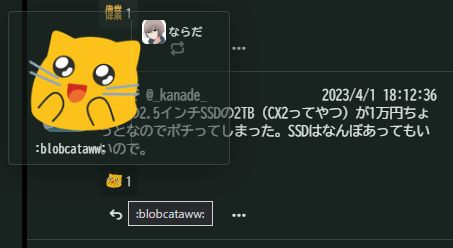  
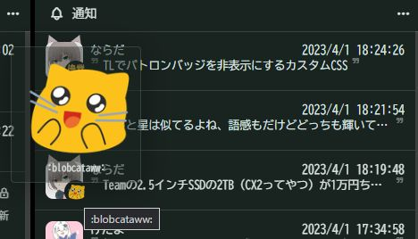  
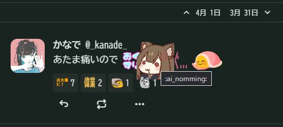
```css
/**
 * ホバー時の絵文字を拡大
 */
/* ノートテキストに含まれる絵文字 */
.x48yH .xeJ4G:hover {
    transform: scale(2); /* 拡大率（1.5とかの指定もできる） */
    position: relative;
    z-index: 100;
}

/* 通知のリアクションを拡大 */
.xeJ4G.x5kTm.xhB9k.xdOTe {
    width: 120px; /* 拡大したい絵文字の幅 */
}

/* ノートに付いているリアクションを拡大 */
.xeJ4G.x5kTm.xhB9k.xunY9 {
    width: 120px; /* 拡大したい絵文字の幅 */   
}
```

---

### ウィジェット編集

```css
/**
 * iPhone 14などノッチありデバイスでウィジェット編集が押せない問題に対処
 */
.xsN7f {
    top: 2vh !important;
    height: 92dvh !important;
    border-radius: var(--radius);
}

/* ウィジェット編集をアイコンのみ＆位置調整 */
.mk-widget-edit {
    font-size: 0 !important;
    position: absolute;
    right: 0;
    text-decoration: none !important;
    line-height: 2rem;
}
.mk-widget-edit .ti:before {
    font-size: 1.3rem;
}
```

---

### Misskey.ioのアイコン差し替え（宇宙猫対策）

```css
/**
 * Misskey.io アイコン差し替え
 */

:root {
    --misskey-icon: url("https://s3.arkjp.net/emoji/blobcatnomblobdoggo.png") no-repeat;
}

/* サイドバー */
.item._button.instance > img {
    display: none !important;
}
.item._button.instance:before {
    display: inline-block;
    content: "";
    background: var(--misskey-icon);
    height: 48px;
    width: 48px;
    background-size: contain;
}
.top .banner {
    display: none !important;
}

/* ローディング */
#splash > img {
    display: none !important;
}
#splash:before {
    display: inline-block;
    content: "";
    background: var(--misskey-icon);
    height: 48px;
    width: 48px;
    background-size: contain;
    position: absolute;
    top: 0;
    right: 0;
    bottom: 0;
    left: 0;
    margin: auto;
}

/* サーバー情報 */
.fwhjspax {
    background-image: none !important;
}
.fwhjspax .content > img {
    display: none !important;
}
.fwhjspax .content:before {
    display: inline-block;
    content: "";
    background: var(--misskey-icon);
    height: 64px;
    width: 64px;
    margin: 16px auto 0;
    border-radius: 8px;
    background-size: contain;
}
```
---

### 「サーバーから切断されました」を非表示
```css
/**
 * 「サーバーから切断されました」を非表示
 */
.xn5WL {
    display: none;
}
```

---

### ドライブの画像を大きくする
サムネが小っちゃくて選びづらいので拡大します。  
サイズはPCで確認しているので、スマホ向けは適時調整してください。  

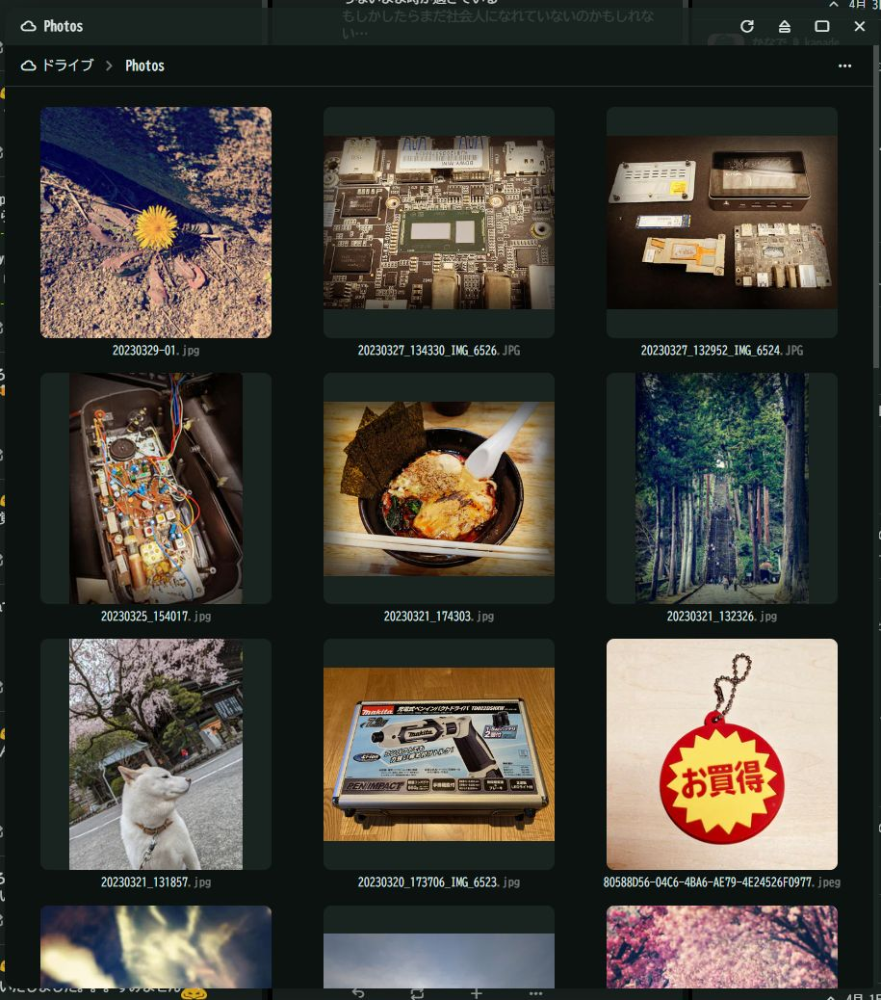
```css
/* ドライブの画像を大きくする */
.xCJma .x6vbC {
    width: 240px;
}
.xDq9N {
    width: 240px;
    height: 240px;
}
.x4Rm8 {
    width: 240px;
    height: 240px;
}
```

---

### 投稿時に添付画像サムネイルを大きくする
添付済みの画像を見やすいサイズに拡大します。  
サイズはPCで確認しているので、スマホ向けは適時調整してください。  

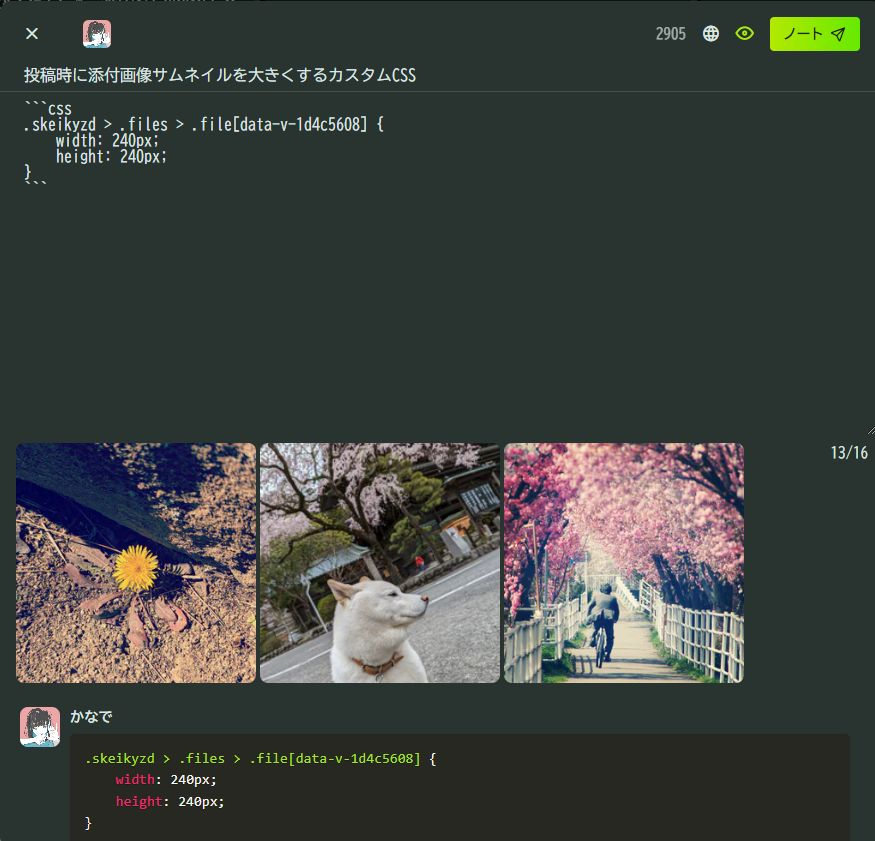
```css
/**
 * 投稿時に添付画像サムネイルを大きくする
 */
.xtEVP {
    width: 240px;
    height: 240px
}
```

---

### サーバー切断時のボタンをいい感じにする
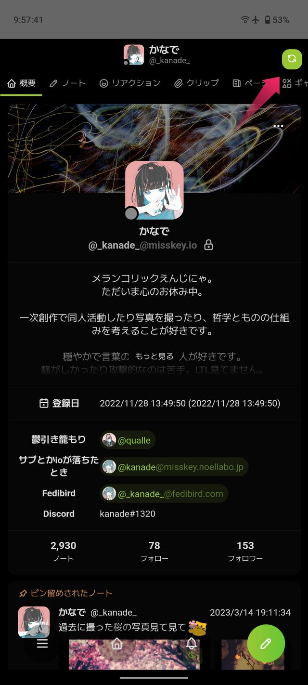
```css
/**
 * サーバー切断時のボタンをいい感じにする
 */
.xn5WL {
    width: 32px;
    height: 32px;
    right: 16px;
    top: 16px;
    padding: 0 !important;
}

.xn5WL div:not([class]) {
    display: none;
}

.xbaFh.xrmjY {
    display: none;
    padding: 0 !important;
}

.xn5WL .xBtVI {
    margin-top: 0 !important;
}

.xn5WL .x2hCn.xrmjY {
    display: inline-block;
    width: 32px;
    height: 32px;
    min-width: initial !important;  
}

.xbaFh.x2hCn.xrmjY:before {
    font-size: 128%;
    content: "\eb13";
    font-family: "tabler-icons" !important;
    text-align: center;
    line-height: 1em;
    font-style: normal;
    font-weight: normal;
    font-variant: normal;
    text-transform: none;
}

.xn5WL .x2hCn.xrmjY .xossv {
    display: none;
}

```

---

### 特定のノートに対する通知を通知欄から非表示にする
```css
/**
 * 特定のノートに対する通知を通知欄から非表示にする
 * xxxxxxxxxx をノートのIDに書き換えてください

 * 複数指定する場合はカンマで追加できます（こんな感じ）
 .x9Bba._panel.notification:has([href="/notes/xxxxxxxxxx"]),
 .x9Bba._panel.notification:has([href="/notes/yyyyyyyyyy"]),
 .x9Bba._panel.notification:has([href="/notes/zzzzzzzzzz"])
 {
    display: none !important;
 }
 */
.x9Bba._panel.notification:has([href="/notes/xxxxxxxxxx"]) {
    display: none !important;
}

```


---

### UIアニメーションを減らしていてもねこ耳を動かせるようにする
```css
/**
 * アニメーションを減らしていてもねこ耳を動かせるようにする
 */
.xyRmg > .xbyxl > .xhUxx {
    animation: xfFGo 6s infinite;
}
.xyRmg > .xbyxl > .xudJZ {
    animation: xF0Qs 6s infinite;
}
.xyRmg:hover > .xbyxl > .xhUxx {
    animation: xzoAW 1s infinite;
}
.xyRmg:hover > .xbyxl > .xudJZ {
    animation: x7I3Z 1s infinite;
}
```

---

### 通知のリンク幅を文字列の部分だけにする
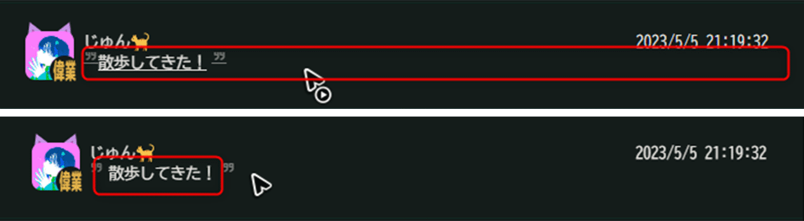
```css
/**
 * 通知のリンク幅を文字列の部分だけにする
 */
.xi4PS {
    display: initial;
}
```

---

### ユーザーアイコンの差し替え
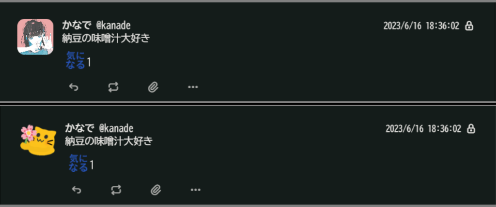

[プラグインを作成しました](https://github.com/kanade/misskey-plugin/blob/main/%E3%83%A6%E3%83%BC%E3%82%B6%E3%83%BC%E3%82%A2%E3%82%A4%E3%82%B3%E3%83%B3%E3%81%AE%E5%B7%AE%E3%81%97%E6%9B%BF%E3%81%88.txt)  
こっちのほうが実用的。
```css
/**
 * アイコンは苦手だけどTLで見ていたい人がいる場合に便利かも
 * 
 * [href="/@kanade"] の部分をユーザーIDに変更する
 * リモートサーバでも可。その場合は
 * [href="/@kanade@mfmf.club"] のようにする
 * 指定を増やす場合は最後の行以外をカンマで繋げる
*/

/* ==== タイムライン ==== */
/* プロフ画像とねこ耳を非表示 */
.x5yeR > [href="/@kanade"] > .xraw1,
.x5yeR > [href="/@kanade"] > .xbyxl
{
    display: none;
}

/* アイコンの差し替え */
.x5yeR > [href="/@kanade"]:after
{
    display: inline-block;
    content: "";
    /* 差し替えたい画像のURLを指定してください */
    background: url("https://mfmf.s3.ap-northeast-1.wasabisys.com/media/06c6fd67-2563-4e51-8376-ae3e7db0d2da.png") no-repeat;
    background-size: contain;
    height: 42px;
    width: 42px;
}

/* ==== 通知欄 ==== */
/* プロフ画像とねこ耳を非表示 */
.xwUec > [href="/@kanade"] > .xraw1,
.xwUec > [href="/@kanade"] > .xbyxl,
.x3YLY > [href="/@kanade"] > .xraw1,
.x3YLY > [href="/@kanade"] > .xbyxl
{
    display: none;
}
/* アイコンの差し替え */
.xwUec > [href="/@kanade"]:after,
.x3YLY > [href="/@kanade"]:after
{
    display: inline-block;
    content: "";
    /* 差し替えたい画像のURLを指定してください */
    background: url("https://mfmf.s3.ap-northeast-1.wasabisys.com/media/06c6fd67-2563-4e51-8376-ae3e7db0d2da.png") no-repeat;
    background-size: contain;
    height: 42px;
    width: 42px;
}

```

---

### NSFW画像のサムネをクリック後もぼかす
~~非NSFW画像のうち、GIF画像やALTが付与されている画像も対象になってしまっているようです。  
そのうち修正したいですがDOMの構造上難しいと思います。  
ご利用の際は上記をご了承ください。~~  
解決したと思います。

NSFWのクリック前  
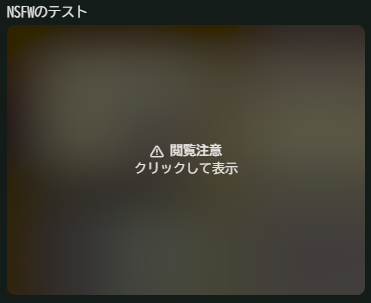

クリックしたあと（標準だとブラーがかからずそのまま表示されます）  
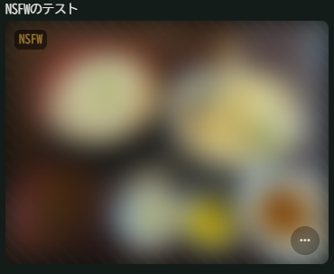
```css
/**
 * NSFW画像をクリック後もぼかす
 */
.xcKaF:has(+ .x4RFf .ti-eye-exclamation) {
    filter: blur(16px); /* 大きい数値ほどぼかし度合いが高くなる */
}

.xcKaF:has(+ .x4RFf .ti-eye-exclamation):hover {
    filter: none;
}
```

---

### NSFWを含むノートを非表示
```css
/**
 * NSFWを含むノートを非表示
 */
/* NSFWを隠さない設定のとき */
.xcSej.x3762:has(.x4RFf .ti-eye-exclamation) {
    display: none;
}

/* NSFWを隠す設定のとき */
.xcSej.x3762:has(.xBp91) {
    display: none;
```

---

### リアクションのホバー時にポップアップを非表示
```css
/**
 * リアクションのホバー時にポップアップを非表示
 */
/* ポップアップ自体を非表示 */
.xu3k3._acrylic._shadow {
    display: none;
}
```

---

### リアクションのホバー時にリアクションしたユーザー一覧を非表示
```css
/**
 * リアクションのホバー時にリアクションしたユーザー一覧を非表示
 */
/* リアクションしたユーザー一覧を非表示 */
.xu3k3 .xtB4B {
    display: none;
}
```

---

### リアクションの数を非表示
```css
/**
 * リアクションの数を非表示
 */
.xDpSv {
    display: none;
}
```

---

### デッキUIでLTLの画像をぼかす
カラムが「メイン」ではなく「タイムライン」である必要があります。
```css
/**
 * デッキUIでLTLの画像をぼかす
 */
 /* 画像サイズを制限 */
.xAOWy:has(.ti-planet) .xutAY.xsfFg {
    max-height: 120px !important;
}
/* ぼかしをかける */
.xAOWy:has(.ti-planet) .xcKaF {
    filter: blur(16px); /* 大きい数値ほどぼかし度合いが高くなる */
}
/* マウスカーソルを重ねるとぼかしを解除 */
.xAOWy:has(.ti-planet) .xcKaF:hover {
    filter: none;
}
```

---

### デフォルトUIでLTLの画像をぼかす
```css
/**
 * デフォルトUIでLTLの画像をぼかす
 */
/* 画像サイズを制限 */
.xFdHz:has(.xo5lq.xj7PE.xvOIQ .ti-planet) .xcSej.x3762 .xutAY {
    max-height: 120px !important;
}
/* ぼかしをかける */
.xFdHz:has(.xo5lq.xj7PE.xvOIQ .ti-planet) .xcSej.x3762 .xcKaF {
    filter: blur(16px); /* 大きい数値ほどぼかし度合いが高くなる */
}
/* マウスカーソルを重ねるとぼかしを解除 */
.xFdHz:has(.xo5lq.xj7PE.xvOIQ .ti-planet) .xcSej.x3762 .xcKaF:hover {
    filter: none;
}
```

---
### 通知インジケータから件数を消す

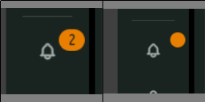
```css
/**
 * 通知インジケータから件数を消す
 */
._indicateCounter {
    font-size: 0;
    width: 16px;
    height: 16px;
}
```

---
### 通知インジケータそのものを消す
```css
/**
 * 通知インジケータそのものを消す
 */
.xxiU7 {
    display: none;
}
```

スマホだとこっちじゃないと消えないかも
```css
/**
 * 通知インジケータそのものを消す
 */
._indicateCounter {
    display: none;
}
```

---
### テンプレ
```css
/**
 * 
 */

```

---

# 欲しいものリスト
[お役に立てましたらぜひ](https://www.amazon.jp/hz/wishlist/ls/2ZO0R36GVTG6M)  
